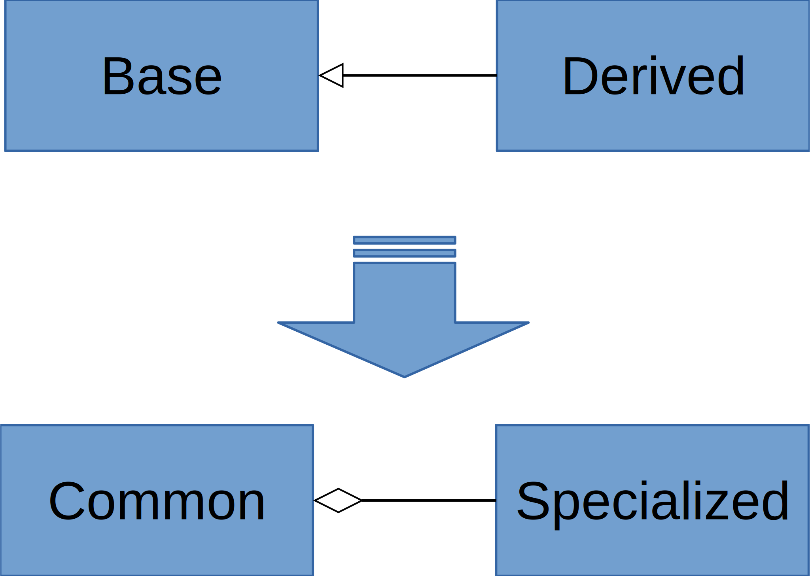

# Prefer Composition over Inheritance
This project aims to demonstrate why composition should be prefered to inheritance. I first present two common ways inheritance is used and show the corresponding issues with testability which are resolved by using composition. In the final scenario, I show a common way inheritance causes subtle issues that do not exist with composition.
## Template Method
One way inheritance is generally used is to perform something like the [template method pattern](https://en.wikipedia.org/wiki/Template_method_pattern). Template method is where a base class implements the template method, which consists of a sequence of steps that need to be performed in a certain order. The steps are implemented by derived classes in order to tailor to specific needs. The example given is to make a beverage. In this contrived example, to make a beverage you must first brew then add the condiments. See the `Composition.Template` and `CompositionUnitTests.Template` namespaces.
### Inheritance
* `Base` defines `MakeBeverage()` method, which invokes the abstract `Brew()` and then `AddCondiments()` methods.
* `Derived` implements `Brew()` and `AddCondiments()`. The thing to notice is that `Brew()` is very involved, while `AddCondiments()` is simple.
* `DerivedTests` demonstrates what it would take to `VerifyOnlyAddsChocolate()`
  * `AddCondiments()` is not accessible, so `MakeBeverage()` is called.
  * However, to make the beverage, `Brew()` is called, which is very involved.
  * **To write a simple test for `AddCondiments()`, a bunch of work has to be done to make `Brew()` work.**
  * You may be thinking to simply make `AddCondiments()` public. However, there still **is no way of writing a good,simple test to ensure `MakeBeverage()` works correctly**. A bad test might mock the very class you're testing. However, that's a dangerous, because you can wind up accidentally mocking the class you're testing into passing your tests.
### The Solution
Change inheritance to composition.

* `Base` becomes `Common`
* `Derived` becomes `Specialized`
* `Common` is composed with `Specialized`
### Composition
* `SpecializedTests.VerifyOnlyAddsChocolate()`
  * There is no setup required to make `Brew()` work!
  * If `Brew()` is modified or any of the brewers' APIs change, this test can remain unchanged and still work!
* `CommonTests`: I can now write simple tests for `MakeBeverage()`, like `VerifyAddsCondimentsToWhatsBrewed()` because everything in `Specialized()` is mocked to return simple values!
## Shared Code
Another common scenario where inheritance is used is to share common code. The common code resides in the base class and is inherited by derived classes in order to consume that functionality. The contrived example given is to fit a gaussian curve in order to add a certain *meaningful (because I say it is)* offset. See the `Composition.Share` and `CompositionUnitTests.Share` namespaces.
### Inheritance
* `Base` implements a 3-point gaussian fit. The idea here is that it's difficult to do this.
* `Dervied` inherites base to calculate the mean to simply add its *meaningful* offset.
* `DerviedTests`: The goal is to `VerifyOffsetsMeanByFive`.
  * **I have to do a lot of work to fabricate a set of numbers to give a specified mean.**
  * One should not simply create fake numbers and set a breakpoint to grab the mean to use in that test. That's a dangerous way of accidentally passing the test. For the reason you passed the test may be because the numbers you picked *happened* to work out.
  * **If the base class gets modified, it can break this unrelated test.**
### The Solution
Change inheritance to composition.

* `Base` becomes `Common`
* `Derived` becomes `Specialized`
* And this time, `Specialized` is composed with `Common`
### Composition
`SpecializedTests.VerifyOffsetMeanByFive()`
* `Common` can be easily mocked to return simple results!
* Modifications to the `Fit()` alorithm will not impact this test!
## State
The final scenario is when a derived class inherits from a base class in order to fulfil some interface. It wants to leave one method in the interface implemented with common functionality from the base class. But it wants to replace the other method with specialized functionality. The example given modifies state in the specialized method from the base class. See the `Composition.Shared` and `CompositionUnitTests.Shared` namespaces.
### Inheritance
`Base` implements the interface
* It manipulates public state (`Stuff`) in `DoSpecializedThings()`, but not in `DoCommonThings()`
* `UserOfBase` calls `DoSpecializedThings()` and then uses `Stuff`
* `Derived` inherits from `Base` to fulfil the interface, but overrides `DoSpecializedThings()` with its own implementation.
    * `UserOfBase` is now broken because `Stuff` is not correct after invoking `DoSpecializedThings()`.
    * This may be and easier issue to catch at first, but what happens if `Base` started out not modifying `Stuff` and then is changed to modify `Stuff` without knowledge that `Derived` needs to be changed.
    * It may also not be possible to modify `Stuff` from `Derived` as in this scenario because the setter is private and Stuff is immutable.
### The Solution
Change inheritance to composition.

* `Base` becomes `Common`
* `Derived` becomes `Specialized`
* `UserOfBase` becomes `UserOfCommon`
* BOTH `Specialized` and `Common` implement the interface
* `Specialized` is composed with `Common` to use it to implement `DoCommonThings`
### Composition
It is now impossible for `UserOfCommon` to get handed a `Specialized`, where `DoSpecializedThings()` does not properly mutate `Common.Stuff` in a statically-typed language. In effect, using composition prevented this bug.
## Conclusion
I demonstrated that using composition instead of inheritance increases testability and decreases bugs thereby increasing maintainability. You will find that composition is also more versatile as now injected implementations can be swapped out for other ones. 

However, it should be noted that you can't *always* use composition. The one place I've found where you need inheritance is in the UI. This is specifically due to the following combination of requirements:
* Empty constructors are needed.
* The responsibility of the view is to create its own components (instead of being injected with them)
* Lots of common functionality is required in each component.

So the only way to get this functionality is to inherit it. It's not that testable (not by unit tests, coded UI tests are more like integration tests). However, the UI should be limited to only the UI by using an MV* design pattern like [MVVM](https://msdn.microsoft.com/en-us/library/hh848246.aspx). You can also create objects that you are composed with to help you do your job or even implement common functionality and those classes might be testable.